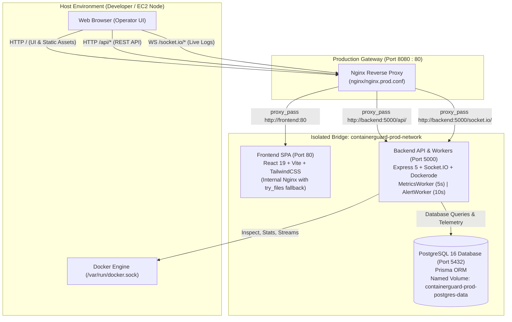

# ContainerGuard 🛡️
### Production-Grade Docker Container Security, Observability & Compliance Platform

ContainerGuard is a modern, unified container security and monitoring platform built with React, Node.js/Express, PostgreSQL (Prisma ORM), and Dockerode. It provides real-time workload discovery, historical cgroups telemetry, live container log streaming, deterministic security policy compliance, and automated vulnerability scanning via Aqua Security Trivy.

---

## 🏛️ System Architecture



---

## 🌐 Network Topology & Port Matrix

| Service | Container Name | Internal Port | Host Port (Dev) | Host Port (Prod) | Exposure Rationale |
| :--- | :--- | :--- | :--- | :--- | :--- |
| **Nginx Gateway** | `containerguard-prod-nginx` | `80` | — | `8080` (or `PROD_HTTP_PORT`) | **Public entrypoint**. Routes `/`, `/api/`, and `/socket.io/`. |
| **Frontend** | `containerguard-prod-frontend` | `80` | `5173` | *None* | Internal only in prod. SPA fallback handled by container Nginx. |
| **Backend** | `containerguard-prod-backend` | `5000` | `5000` | *None* | Internal only in prod. Accessible solely via Gateway reverse proxy. |
| **PostgreSQL** | `containerguard-prod-postgres` | `5432` | `5433` (optional tooling) | *None* | Internal only in prod. Database is never exposed to the host or internet. |

> [!NOTE]
> **Docker Socket Security**: The Docker Engine socket (`/var/run/docker.sock`) is mounted **exclusively** into the Backend container. Neither Nginx, Frontend, nor PostgreSQL have access to the Docker socket.

---

## ✨ Core Implemented Capabilities

### 1. Workload Observability & Management
- **Engine Discovery**: Automatic detection of running and stopped containers via Dockerode.
- **Deep Inspection**: View container configuration, port bindings, networks, mounts, restart policies, and sanitized environment variables.
- **Hardware Telemetry Worker**: Background daemon collecting container CPU%, memory usage, and network Rx/Tx throughput every 5s, persisted to PostgreSQL.
- **Historical Metrics Visualizer**: Interactive Recharts timeline rendering container resource utilization over time.

### 2. Real-Time Container Log Streaming
- **Socket.IO Engine**: Real-time log multiplexer subscribing directly to Docker container stdout/stderr streams.
- **Binary Demultiplexing**: Safely demuxes Docker's 8-byte header binary log format into clean UTF-8 text.
- **Operator Controls**: Keyword search filtering, pause/resume auto-scroll follow, and instant terminal clearing.

### 3. Vulnerability Scanning & Supply Chain Security
- **Aqua Security Trivy Integration**: On-demand CLI vulnerability scanner packaged into the backend Docker image.
- **Database Scan Persistence**: Stores complete CVE findings, affected packages, fixed versions, and severity summaries.
- **Scan Comparison & Trend Tracking**: Computes diffs across historical image scans (new CVEs, resolved CVEs) with chronological trend charts.

### 4. Deterministic Security Policy Engine
Evaluates container runtime security configurations against strict compliance rules with deterministic scoring (0–100 baseline):
- **`CG001` (Root User)**: Detects containers running as `root` (`UID 0`).
- **`CG002` (Privileged Mode)**: Flags containers with `--privileged=true`.
- **`CG003` (Missing Healthcheck)**: Flags containers lacking a Docker `HEALTHCHECK` probe.
- **`CG004` (Critical Vulnerabilities)**: Deducts compliance score when critical CVEs exist in target images.
- **`CG005` (Excessive Capabilities)**: Flags dangerous Linux kernel capabilities (`SYS_ADMIN`, `NET_ADMIN`, `SYS_PTRACE`, `DAC_OVERRIDE`, `NET_RAW`).
- **`CG006` (Host Networking)**: Flags containers utilizing `HostConfig.NetworkMode = host`.

### 5. Persistent Operational & Security Alert System
Evaluates system metrics and security posture every 10 seconds through an autonomous background worker:
- **`AL001` (High CPU)**: Container CPU utilization exceeds 80%.
- **`AL002` (High Memory)**: Container memory usage exceeds 80%.
- **`AL003` (Unhealthy Container)**: Container fails internal Docker healthcheck probes.
- **`AL004` (Restart Loop)**: Container restarts $\ge 3$ times within a 300-second window.
- **`AL005` (Critical CVEs)**: Associated container image contains critical vulnerabilities.
- **`AL006` (Low Compliance Score)**: Policy compliance score falls below 70 / 100.
- **State Machine Lifecycle**: Persistent transitions (`OPEN` $\rightarrow$ `ACKNOWLEDGED` $\rightarrow$ `RESOLVED`). Automatically resolves alerts when operational conditions stabilize.

---

## 🚀 Quickstart & Deployment

### Prerequisites
- Docker Engine $\ge 24.0$ & Docker Compose v2
- Node.js $\ge 20$ (for local development outside containers)

### Production Stack (Nginx Gateway + Compose)

1. **Configure Environment Variables**:
   ```bash
   cp .env.prod.example .env.prod
   # Edit .env.prod to set your secure POSTGRES_PASSWORD
   ```

2. **Launch Production Stack**:
   ```bash
   docker compose -f docker-compose.prod.yml --env-file .env.prod -p containerguard-prod up -d --build
   ```

3. **Verify Health**:
   ```bash
   docker compose -f docker-compose.prod.yml -p containerguard-prod ps
   curl -f http://localhost:8080/healthz
   ```

4. **Access Platform**:
   - Web Application: [http://localhost:8080](http://localhost:8080)
   - REST API: [http://localhost:8080/api/health](http://localhost:8080/api/health)

### Development Stack

1. **Configure Development Environment**:
   ```bash
   cp .env.docker.example .env
   ```

2. **Launch Development Containers**:
   ```bash
   docker compose up -d
   ```

---

## 📡 REST API Reference

| Endpoint | Method | Description |
| :--- | :--- | :--- |
| `/api/health` | `GET` | Subsystem connectivity (database, uptime, service status). |
| `/api/docker/ping` | `GET` | Lightweight Docker daemon socket check. |
| `/api/docker/info` | `GET` | Host architecture, OS, memory, and engine metadata. |
| `/api/docker/containers` | `GET` | List all running and stopped containers. |
| `/api/docker/containers/:id` | `GET` | Deep inspection of container config (credentials masked). |
| `/api/docker/images` | `GET` | List local Docker images and repository tags. |
| `/api/docker/networks` | `GET` | Discovered Docker networks and connected containers. |
| `/api/docker/volumes` | `GET` | Discovered Docker storage volumes. |
| `/api/metrics` | `GET` | In-memory current metrics for all active containers. |
| `/api/metrics/:containerId/history` | `GET` | Chronological time-series metrics from PostgreSQL. |
| `/api/security/trivy-status` | `GET` | Trivy CLI binary availability check. |
| `/api/security/scan` | `POST` | Trigger vulnerability scan on image (`{"image": "nginx:alpine"}`). |
| `/api/security/scans` | `GET` | List historical vulnerability scans. |
| `/api/security/policies/summary` | `GET` | System-wide compliance score and container violation summary. |
| `/api/security/policies/:id` | `GET` | Individual container policy rules evaluation and score. |
| `/api/alerts/summary` | `GET` | Aggregate counts of open, acknowledged, and critical alerts. |
| `/api/alerts` | `GET` | Query alerts filtered by `status`, `severity`, or `source`. |
| `/api/alerts/:id/acknowledge` | `PATCH` | Transition alert status to `ACKNOWLEDGED`. |
| `/api/alerts/:id/resolve` | `PATCH` | Transition alert status to `RESOLVED` with reason. |

---

## 🔒 Security Hardening

- **No Public Database Exposure**: PostgreSQL port `5432` is bound only to the internal bridge network.
- **Docker Socket Isolation**: The Docker socket is mounted strictly read-write to the backend container. Frontend and Gateway containers have zero socket privileges.
- **Credential Masking**: Container environment variables matching sensitive patterns (`password`, `secret`, `token`, `key`, `cred`) are automatically masked (`********`) prior to transmission to clients.
- **Controlled Error Responses**: Production error middleware suppresses stack traces, filesystem paths, and internal Prisma ORM error classes.
- **Command Injection Prevention**: Image input parameters for Trivy scanning are validated against strict alphanumeric regex patterns and executed via `execFile` without shell interpolation.
- **Keyless AWS Authentication**: GitHub Actions CI/CD pipeline deploys using AWS OIDC role assumption, requiring zero long-lived AWS IAM access keys in the repository.

---

## 🗺️ Roadmap & Phase Status

- [x] **Phase 1–4**: Full-Stack Architecture, PostgreSQL & Dockerization
- [x] **Phase 5–10**: Docker Management, Metrics Worker & Live Socket.IO Logs
- [x] **Phase 11–13**: Trivy Vulnerability Scanning, Scan Diffs & Policy Engine (CG001–CG006)
- [x] **Phase 14**: Operational & Security Alert System (AL001–AL006)
- [x] **Phase 15**: Isolated Production Docker Compose (`docker-compose.prod.yml`)
- [x] **Phase 16**: Production Nginx Reverse Proxy Gateway
- [x] **Phase 17**: Production Hardening, Security Audit & UI/Code Cleanup
- [ ] **Phase 18**: Immutable Git Commit SHA Image Deployments & Rollbacks *(Planned)*
- [ ] **Phase 19**: AWS CloudWatch Alarms & System Polish *(Planned)*
